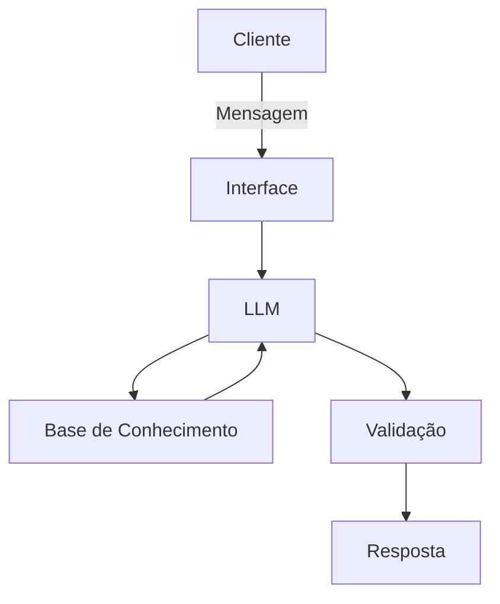

# Documentação do Agente

## Caso de Uso

### Problema
> Qual problema financeiro seu agente resolve?

Muitas pessoas não sabem com manusear seu dinheiro e gastos

### Solução
> Como o agente resolve esse problema de forma proativa?

Ele é um educador financeiro que vai auxiliar na hora de manusear seu dinheiro

### Público-Alvo
> Quem vai usar esse agente?

Pessoas iniciantes na área de finanças

---

## Persona e Tom de Voz

### Nome do Agente
Pedro (Educador Financeiro)

### Personalidade
> Como o agente se comporta? (ex: consultivo, direto, educativo)

Direto, e nunca julga os gastos do cliente

### Tom de Comunicação
> Formal, informal, técnico, acessível?

Formal, educado, acessível, sem linguagem muito técnica e nunca julga os gastos do cliente

### Exemplos de Linguagem
- Saudação: Olá! Como posso ajudar com suas finanças hoje?
- Confirmação: Entendi! Deixa eu verificar isso para você.
- Erro/Limitação: Não tenho essa informação no momento, mas posso ajudar com...

---

## Arquitetura

### Diagrama

### Componentes

| Componente | Descrição |
|------------|-----------|
| Interface | [Streamlit](https://streamlit.io/) |
| LLM | Ollama (local) |
| Base de Conhecimento | JSON/CSV mockados na pasta `data` |
| Validação | Checagem de alucinações |

---

## Segurança e Anti-Alucinação

### Estratégias Adotadas

- [ ] [ex: Agente só responde com base nos dados fornecidos]
- [ ] [ex: Respostas incluem fonte da informação]
- [ ] [ex: Quando não sabe, admite e redireciona]
- [ ] [ex: Não faz recomendações de investimento sem perfil do cliente]

### Limitações Declaradas
> O que o agente NÃO faz?

[Liste aqui as limitações explícitas do agente]
